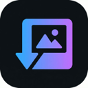
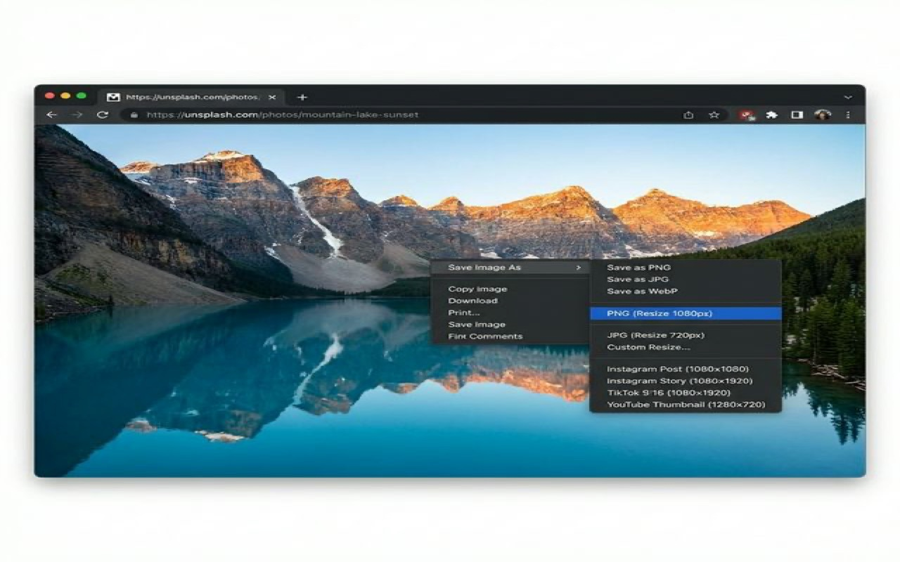
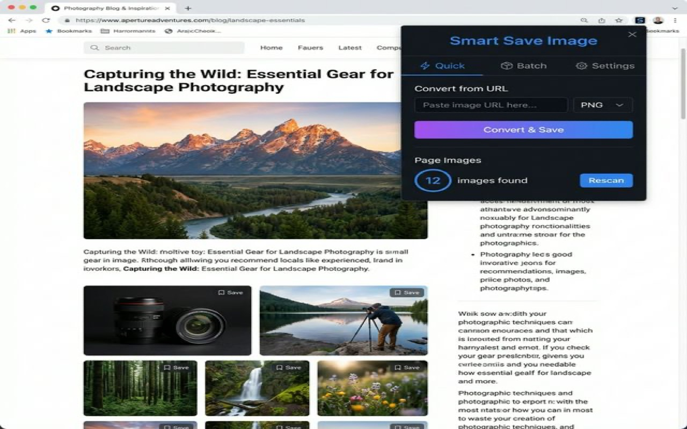
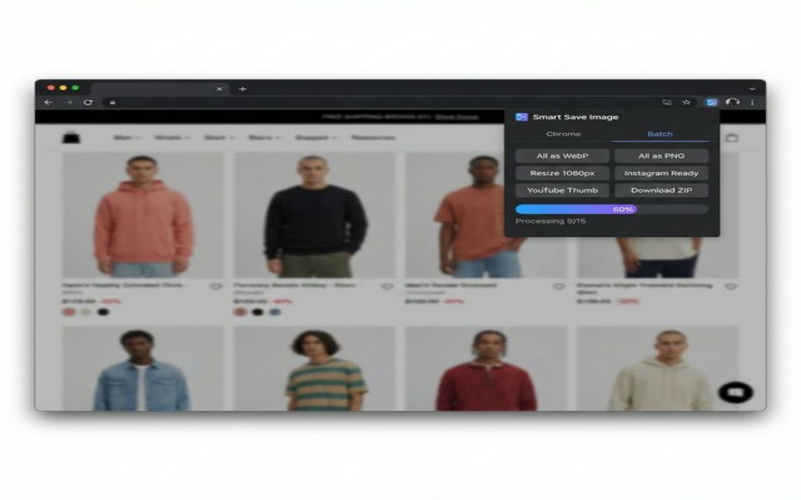
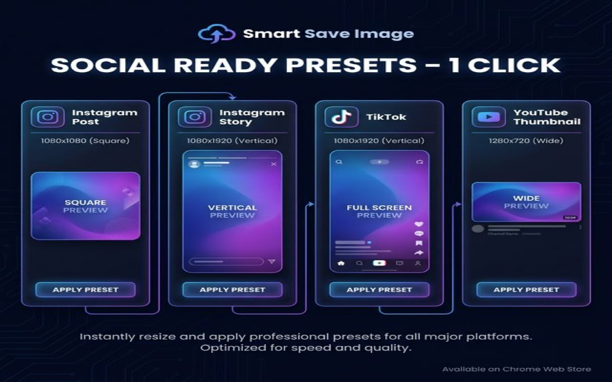

  

<h1 align="center">Smart Save Image – Convert, Resize & Optimize</h1>

  <strong>Right-click any image → instantly save as PNG, JPG, WebP with resize, optimize & social media presets.</strong> 
  100% local processing. No uploads. No tracking.

  
  &nbsp;
  
  
  

---

## 📸 Screenshots

  
  

  
  

---

## ⚡ Key Features

| Feature | Description |
|---------|-------------|
| 🖱️ **Right-Click Smart Save** | Right-click any image → choose PNG, JPG, or WebP from the context menu |
| 📐 **Resize While Saving** | Preset sizes (1080px, 720px) or custom dimensions with aspect ratio lock |
| 📱 **Social Media Presets** | One-click export: Instagram Post/Story, TikTok, YouTube Thumbnail |
| 📦 **Batch Save All Images** | Scan page → convert all images at once → download as ZIP |
| 🔗 **Convert from URL** | Paste any image URL, pick format, and save |
| 🎯 **Smart Optimization** | Auto quality optimization with before/after size comparison |
| 🔒 **100% Local** | All processing in your browser. Zero data leaves your device |

### 📱 Social Media Presets

| Platform | Dimensions |
|----------|-----------|
| Instagram Post | 1080 × 1080 |
| Instagram Story | 1080 × 1920 |
| TikTok | 1080 × 1920 |
| YouTube Thumbnail | 1280 × 720 |

---

## 📋 How It Works

1. **Right-click** any image on a webpage
2. Select **"Save Image As"** from the context menu
3. Choose your **format**, **size**, or **social preset**
4. ✅ Done — image saved to your Downloads folder

> Or open the popup for **batch operations** and **URL conversion**.

---

## 🛠️ Installation

### From Chrome Web Store (Recommended)

👉 [**Install Smart Save Image**](https://chromewebstore.google.com/detail/smart-save-image/YOUR_EXTENSION_ID)

### Manual Installation (Developer Mode)

1. Download or clone this repository
2. Open `chrome://extensions/` in Chrome
3. Enable **Developer mode** (top right)
4. Click **Load unpacked**
5. Select the project folder

---

## 🔒 Privacy & Permissions

| Permission | Why It's Needed |
|-----------|----------------|
| `contextMenus` | Add "Save Image As" to right-click menu |
| `activeTab` | Access images on the current page |
| `downloads` | Save converted images to your device |
| `storage` | Remember your preferences |
| `offscreen` | Process images using Canvas API |

> **No data is sent anywhere. No login. No tracking. No ads.**

---

## 🌍 Multi-language / Đa ngôn ngữ

🇬🇧 <strong>English</strong>

**Smart Save Image – Convert, Resize & Optimize**

Right-click any image → instantly save as PNG, JPG, or WebP. Resize, optimize, and export social-ready images — all processed locally on your device. Free, no ads, no account required.

👉 [Install from Chrome Web Store](https://chromewebstore.google.com/detail/smart-save-image/YOUR_EXTENSION_ID)

🇻🇳 <strong>Tiếng Việt</strong>

**Smart Save Image – Chuyển đổi, Thay đổi kích thước & Tối ưu hóa ảnh**

Nhấp chuột phải vào bất kỳ hình ảnh nào → lưu ngay dưới dạng PNG, JPG hoặc WebP. Thay đổi kích thước, tối ưu hóa và xuất ảnh sẵn sàng cho mạng xã hội — tất cả được xử lý cục bộ trên thiết bị của bạn. Miễn phí, không quảng cáo, không cần tài khoản.

👉 [Cài đặt từ Chrome Web Store](https://chromewebstore.google.com/detail/smart-save-image/YOUR_EXTENSION_ID)

🇨🇳 <strong>中文 (简体)</strong>

**Smart Save Image – 转换、调整大小和优化图片**

右键点击任何图片 → 立即保存为 PNG、JPG 或 WebP。调整大小、优化并导出适用于社交媒体的图片 — 全部在本地设备上处理。免费、无广告、无需注册。

👉 [从 Chrome 网上应用店安装](https://chromewebstore.google.com/detail/smart-save-image/YOUR_EXTENSION_ID)

🇹🇼 <strong>中文 (繁體)</strong>

**Smart Save Image – 轉換、調整大小和最佳化圖片**

右鍵點擊任何圖片 → 立即儲存為 PNG、JPG 或 WebP。調整大小、最佳化並匯出適用於社群媒體的圖片 — 全部在本地裝置上處理。免費、無廣告、無需帳號。

👉 [從 Chrome 線上應用程式商店安裝](https://chromewebstore.google.com/detail/smart-save-image/YOUR_EXTENSION_ID)

🇯🇵 <strong>日本語</strong>

**Smart Save Image – 画像の変換、リサイズ、最適化**

画像を右クリック → PNG、JPG、WebP として即座に保存。リサイズ、最適化、SNS用画像のエクスポート — すべてデバイス上でローカル処理。無料、広告なし、アカウント不要。

👉 [Chrome ウェブストアからインストール](https://chromewebstore.google.com/detail/smart-save-image/YOUR_EXTENSION_ID)

🇰🇷 <strong>한국어</strong>

**Smart Save Image – 이미지 변환, 크기 조절 및 최적화**

이미지를 마우스 오른쪽 버튼으로 클릭 → PNG, JPG, WebP로 즉시 저장. 크기 조절, 최적화 및 소셜 미디어용 이미지 내보내기 — 모든 처리가 기기에서 로컬로 수행됩니다. 무료, 광고 없음, 계정 불필요.

👉 [Chrome 웹 스토어에서 설치](https://chromewebstore.google.com/detail/smart-save-image/YOUR_EXTENSION_ID)

🇪🇸 <strong>Español</strong>

**Smart Save Image – Convertir, Redimensionar y Optimizar Imágenes**

Haz clic derecho en cualquier imagen → guárdala al instante como PNG, JPG o WebP. Redimensiona, optimiza y exporta imágenes listas para redes sociales — todo procesado localmente en tu dispositivo. Gratis, sin anuncios, sin necesidad de cuenta.

👉 [Instalar desde Chrome Web Store](https://chromewebstore.google.com/detail/smart-save-image/YOUR_EXTENSION_ID)

🇫🇷 <strong>Français</strong>

**Smart Save Image – Convertir, Redimensionner et Optimiser les Images**

Faites un clic droit sur n'importe quelle image → enregistrez-la instantanément en PNG, JPG ou WebP. Redimensionnez, optimisez et exportez des images prêtes pour les réseaux sociaux — tout est traité localement sur votre appareil. Gratuit, sans publicité, sans compte requis.

👉 [Installer depuis le Chrome Web Store](https://chromewebstore.google.com/detail/smart-save-image/YOUR_EXTENSION_ID)

🇩🇪 <strong>Deutsch</strong>

**Smart Save Image – Bilder Konvertieren, Skalieren und Optimieren**

Rechtsklick auf ein beliebiges Bild → sofort als PNG, JPG oder WebP speichern. Skalieren, optimieren und Social-Media-fertige Bilder exportieren — alles lokal auf deinem Gerät verarbeitet. Kostenlos, werbefrei, kein Konto erforderlich.

👉 [Aus dem Chrome Web Store installieren](https://chromewebstore.google.com/detail/smart-save-image/YOUR_EXTENSION_ID)

🇵🇹 <strong>Português</strong>

**Smart Save Image – Converter, Redimensionar e Otimizar Imagens**

Clique com o botão direito em qualquer imagem → salve instantaneamente como PNG, JPG ou WebP. Redimensione, otimize e exporte imagens prontas para redes sociais — tudo processado localmente no seu dispositivo. Gratuito, sem anúncios, sem necessidade de conta.

👉 [Instalar a partir da Chrome Web Store](https://chromewebstore.google.com/detail/smart-save-image/YOUR_EXTENSION_ID)

🇷🇺 <strong>Русский</strong>

**Smart Save Image – Конвертация, Изменение размера и Оптимизация изображений**

Щелкните правой кнопкой мыши по любому изображению → мгновенно сохраните как PNG, JPG или WebP. Измените размер, оптимизируйте и экспортируйте изображения для соцсетей — всё обрабатывается локально на вашем устройстве. Бесплатно, без рекламы, без регистрации.

👉 [Установить из Chrome Web Store](https://chromewebstore.google.com/detail/smart-save-image/YOUR_EXTENSION_ID)

🇮🇩 <strong>Bahasa Indonesia</strong>

**Smart Save Image – Konversi, Ubah Ukuran & Optimalkan Gambar**

Klik kanan pada gambar apa saja → simpan langsung sebagai PNG, JPG, atau WebP. Ubah ukuran, optimalkan, dan ekspor gambar siap media sosial — semua diproses secara lokal di perangkat Anda. Gratis, tanpa iklan, tanpa perlu akun.

👉 [Instal dari Chrome Web Store](https://chromewebstore.google.com/detail/smart-save-image/YOUR_EXTENSION_ID)

🇹🇭 <strong>ไทย</strong>

**Smart Save Image – แปลง ปรับขนาด และปรับแต่งรูปภาพ**

คลิกขวาที่รูปภาพใดก็ได้ → บันทึกทันทีเป็น PNG, JPG หรือ WebP ปรับขนาด ปรับแต่ง และส่งออกรูปภาพสำหรับโซเชียลมีเดีย — ประมวลผลทั้งหมดในเครื่องของคุณ ฟรี ไม่มีโฆษณา ไม่ต้องสมัครสมาชิก

👉 [ติดตั้งจาก Chrome Web Store](https://chromewebstore.google.com/detail/smart-save-image/YOUR_EXTENSION_ID)

🇮🇳 <strong>हिन्दी</strong>

**Smart Save Image – छवि रूपांतरण, आकार बदलें और अनुकूलित करें**

किसी भी छवि पर राइट-क्लिक करें → तुरंत PNG, JPG या WebP के रूप में सेव करें। आकार बदलें, अनुकूलित करें और सोशल मीडिया के लिए तैयार छवियां निर्यात करें — सब कुछ आपके डिवाइस पर स्थानीय रूप से प्रोसेस होता है। मुफ़्त, कोई विज्ञापन नहीं, कोई खाता आवश्यक नहीं।

👉 [Chrome Web Store से इंस्टॉल करें](https://chromewebstore.google.com/detail/smart-save-image/YOUR_EXTENSION_ID)

🇸🇦 <strong>العربية</strong>

**Smart Save Image – تحويل الصور وتغيير حجمها وتحسينها**

انقر بزر الماوس الأيمن على أي صورة ← احفظها فوراً بصيغة PNG أو JPG أو WebP. غيّر الحجم، حسّن الجودة، وصدّر صوراً جاهزة لوسائل التواصل الاجتماعي — تتم جميع العمليات محلياً على جهازك. مجاني، بدون إعلانات، بدون حساب.

👉 [التثبيت من متجر Chrome الإلكتروني](https://chromewebstore.google.com/detail/smart-save-image/YOUR_EXTENSION_ID)

---

## 🏗️ Tech Stack

- **Manifest V3** — Modern Chrome Extension architecture
- **Canvas API** — Client-side image processing
- **Offscreen Document** — Background image conversion
- **JSZip** — Batch download as ZIP
- **Chrome Context Menus API** — Native right-click integration

---

## ✅ Perfect For

- 🎨 **Content Creators** — Prepare images for social media
- 🖥️ **Web Designers** — Save reference images in specific formats
- ✍️ **Bloggers** — Optimize images for faster page loads
- 👤 **Everyone** — Quick format conversion without online tools

---

## 🔗 Links

| | Link |
|---|------|
| 🌐 Chrome Web Store | [Install Extension](https://chromewebstore.google.com/detail/smart-save-image/YOUR_EXTENSION_ID) |
| 🐛 Report Issues | [GitHub Issues](https://github.com/huuhuybn/Smart-Save-Image-Convert-Resize-Optimize/issues) |
| 💡 Feature Requests | [GitHub Discussions](https://github.com/huuhuybn/Smart-Save-Image-Convert-Resize-Optimize/discussions) |

---

## 📄 License

This project is free and open source.

---

  Made with ❤️ by <a href="https://github.com/huuhuybn">huuhuybn</a> 
  Free • No Ads • No Account Required • Open Source

